# Pipeline

A reference for how a dental site gets rebuilt from URL → built Astro project, with every step's skills, tools, data, and QC checks.

> **Companion doc:** [`SKILLS.md`](./SKILLS.md) — the catalog of every skill, with maturity, gaps, and improvement levers.

---

## One-liner

> Scrape an existing dental site → AI-extract structured data → merge with intake → set creative direction → generate per-section content → build Astro → audit before/after coverage.

---

## High-zoom flow

```mermaid
flowchart LR
  IN([URL or intake.json]):::input
  IN --> P1[1. Scrape<br/><i>bronze</i>]:::scrape
  P1 --> P2[2. Silver<br/><i>AI extract</i>]:::ai
  P2 --> P3[3. Merge<br/><i>silver + intake</i>]:::compute
  P3 --> P4a[4a. Design Extract<br/><i>existing brand</i>]:::ai
  P4a --> P4b[4b. Brand Direction<br/><i>new brand brief</i>]:::ai
  P4b --> P5[5. Director<br/><i>archetype + DNA</i>]:::ai
  P5 --> P6[6. Generate<br/><i>content + pages</i>]:::ai
  P6 --> P7[7. Build<br/><i>Astro</i>]:::compute
  P7 --> P8[8. Audit<br/><i>coverage diff</i>]:::audit
  P8 --> OUT([dist/ + reports]):::output

  classDef input  fill:#eef,stroke:#88a
  classDef scrape fill:#fee,stroke:#c66
  classDef ai     fill:#fed,stroke:#c93
  classDef compute fill:#efe,stroke:#6a6
  classDef audit  fill:#dfe,stroke:#393
  classDef output fill:#eef,stroke:#88a
```



**Legend:**
- 🔴 Scrape (HTTP + parsing)
- 🟠 AI step (Anthropic API)
- 🟢 Compute (deterministic transforms)
- 🟢 Audit (eval / verification)

### The Design phase has two sub-phases

| Sub-phase | What it does |
|---|---|
| **4a · Design Extract** (`ai-design.js`) | Reads the EXISTING site — extracts current palette, current fonts, current mood, brand strength assessment. Pure extraction. |
| **4b · Brand Direction** (`ai-brand-direction.js`) | Decides the NEW brand for the rebuild. Uses extraction signal + practice positioning → produces the brand brief. |

This split was previously bundled under one "Design" phase; clarified in the dashboard so it's obvious which phase is "what's there now" vs "what should we build."

---

## Content rescue: `additionalContent[]`

A cross-cutting feature that prevents content loss. Silver's strict buckets (practice, doctor, services, content.aboutText, etc.) used to drop everything that didn't fit a specific field — pull-quotes, philosophy paragraphs, "Welcome To" intros, office descriptions, blog post bodies, taglines.

The Silver phase now sweeps bronze for distinctive content that didn't land elsewhere and stores it in `silver.content.additionalContent[]`:

```js
{
  type:    "philosophy" | "pullquote" | "welcome" | "blog-post" | "technology" | etc,
  title:   "Our Commitment To The Community",
  content: "Magic Fox Orthodontics strives to meet and exceed...",  // verbatim
  source:  "/about"
}
```

Capped at 30 items, ~2200 chars each. Long pieces get a 1500-char excerpt + `…[truncated]`.

**Downstream consumers** (each filters by `type` + `source`):
- **Doctor brief** — pulls philosophy / pullquote / welcome / mission items, plus any item mentioning the doctor by name. Up to 4 items get formatted into a "Source voice content" block in the prompt.
- **Service-page brief** — pulls items whose `source` matches the service path (e.g. `/services/braces` → items from that page) plus broadly relevant types (technology, specialty-deep-dive, treatment-detail).
- **FAQ brief** — pulls items of types relevant to common questions (financing, insurance, emergency, accessibility, multilingual, approach, first-visit, patient-experience).
- **Blog generator** — uses items of `type: blog-post` as a fallback when bronze.pages doesn't have them.

**Coverage audit** flags `additional-content-not-surfaced` if rescued items don't appear (even partially) in any built page — closing the loop so we know if a downstream skill is silently dropping rescued content.

---

## Data layers

The shape of the data at each step. Most pipeline bugs are about a transformation losing fidelity here.

| Layer | Produced by | Shape | Persisted at |
|---|---|---|---|
| **Bronze** | Phase 1 — scraper | Raw `pages[]` with HTML, headings, paragraphs, JSON-LD, images | `_pipeline/01-bronze.json` |
| **Silver** | Phase 2 — AI extraction | Structured `{ practice, doctor, additionalDoctors, services, content, signals, ... }` | `_pipeline/01-scrape.json` |
| **Merged** | Phase 3 — intake merger | Silver + intake JSON, normalized | `_pipeline/06-merge.json` |
| **Brand brief** | Phase 4 — brand direction | `{ palette, typography, mood, voice, ... }` | `_pipeline/04b-brand.json` |
| **Design DNA** | Phase 5 — director | `{ archetype, heroVariant, designTokens, ... }` | `src/config/design-dna.ts` |
| **Image roles** | Phase 1d — vision classifier | `{ hero, doctorPortrait, doctorPortraits, team, ... }` | `public/images/image-roles.json` |
| **Per-section content JSON** | Phase 6 — section skills | One `*.content.json` per variant section | `src/components/generated/*.content.json` |
| **Built HTML** | Phase 7 — Astro build | Static HTML + assets | `dist/` |
| **Coverage audit** | Phase 8 — diff comparator | `{ findings, summary }` | `_pipeline/coverage-audit.{json,md}` |

---

## Phase 1 · Scrape (bronze)

**Crawls the existing site and dumps raw page content.**

| | |
|---|---|
| **Skills** | (none — pure scraping) |
| **Tools** | `playwright`, custom crawler in `lib/scraper.js` |
| **Inputs** | URL |
| **Outputs** | `_pipeline/01-bronze.json` (raw `pages[]`, headings, paragraphs, JSON-LD, images, links) |
| **QC** | Page count, redirect count, "is bronze empty?" check |
| **Skip flag** | `--skip-scrape` |
| **Cost** | Free (HTTP only) |

**Sub-phase 1d** — image analysis (vision):
| | |
|---|---|
| **Skills** | [`extraction/image-roles`](../skills/extraction/image-roles.md) |
| **Tools** | Anthropic Vision (Haiku 4.5) |
| **Outputs** | Per-image classification with `personName` for doctor-photo pairing |
| **Cache** | Supabase (keyed by URL+slug — same images don't re-classify across builds) |

---

## Phase 2 · Silver (AI extraction)

**Bronze → structured `PracticeData`.**

| | |
|---|---|
| **Skills** | [`extraction/silver`](../skills/extraction/silver.md) (L1) |
| **Tools** | Anthropic Sonnet 4.6 |
| **Inputs** | Bronze pages (selected: home, about, contact, doctor pages, services) |
| **Outputs** | `_pipeline/01-scrape.json` — `{ practice, doctor, additionalDoctors, services, content, brand, signals }` |
| **QC** | Schema validation; flags missing fields; coverage-audit cross-checks bronze JSON-LD person count vs silver doctor count |
| **Skip flag** | `--skip-scrape` (whole phase) |
| **Cost** | Sonnet — moderate per build |

**Critical gotchas:**
- Multi-doctor practices: silver MUST extract every Person/Dentist JSON-LD entry into `doctor` (primary) + `additionalDoctors[]`
- People-rich pages (`/about`, `/team`) get a 6,000-char body cap (vs 1,500 default) so secondary doctor bios aren't truncated

---

## Phase 3 · Merge

**Combines silver + intake.json (if provided) into the merged practice data shape.**

| | |
|---|---|
| **Skills** | (none — deterministic merge in `lib/merger.js`) |
| **Tools** | None |
| **Inputs** | Silver + optional `intake.json` |
| **Outputs** | `merged` (in-memory) + `_pipeline/06-merge.json` summary |
| **QC** | Flags missing-field warnings (e.g. `doctor.name: missing`) |

---

## Phase 4a · Design Extract

**Reads the EXISTING site's design — what's there now.** Pure extraction; no creative direction here.

| | |
|---|---|
| **Skills** | [`design/design-extract`](../skills/design/design-extract.md) (L1) |
| **Tools** | Anthropic Sonnet 4.6, `lib/ai-design.js` |
| **Inputs** | Bronze pages (CSS, fonts, inline styles), audit positioning |
| **Outputs** | `designExtraction` — `{ existingPalette, existingFonts, mood, brandStrength, evolutionSignal, rationale }` |
| **QC** | brandStrength must be one of 4 allowed values; evolutionSignal must be `evolve` or `rebuild` |
| **Cost** | Sonnet — single call |

**Brand strength assessment** drives whether Brand Direction will evolve the existing brand or rebuild from scratch.

---

## Phase 4b · Brand Direction

**Decides the NEW brand for the rebuild.** Takes extraction signals + practice positioning and produces the brand brief.

| | |
|---|---|
| **Skills** | [`design/brand-direction`](../skills/design/brand-direction.md) (L1) |
| **Tools** | Anthropic Sonnet 4.6, palette library, Google Fonts catalog |
| **Inputs** | designExtraction + audit positioning + merged practice data |
| **Outputs** | `brandBrief` — `{ palette, typography, mood, voice, rationale, paletteSource, contrastCheck }` → `_pipeline/04b-brand.json` |
| **QC** | WCAG AA contrast check (advisory in prompt); used-font diversity check |
| **Cost** | Sonnet — single call |

**Personality-driven biasing:**
- Specialist/premium signals → cool palette, grotesque/display type
- Family/community signals → warm palette, humanist serif

---

## Phase 5 · Director (creative DNA)

**Picks the archetype and locks all variant choices.**

| | |
|---|---|
| **Skills** | [`creative/director`](../skills/creative/director.md) (L1) + [`creative/derive-design-tokens`](../skills/creative/derive-design-tokens.md) (L2) |
| **Tools** | Anthropic Sonnet 4.6, design library (own + inspo) |
| **Inputs** | Brand brief, merged data, recent own-builds (for divergence) |
| **Outputs** | `dna` → `src/config/design-dna.ts` |
| **QC** | DNA shape validation, archetype-family check (warm practice mustn't get editorial archetype) |
| **Cost** | Sonnet — multi-candidate (3 candidates evaluated, best chosen) |

**Determinism on top of AI:**
- Director picks freely from enums (archetype, heroVariant, etc.)
- `derive-design-tokens` then OVERRIDES nav/footer/gallery variants based on archetype family
- This guarantees two different archetypes produce visually distinct sites even if the AI gets lazy

---

## Phase 6 · Generate (per-section content + pages)

**Generates one `content.json` per section, plus full service detail pages.**

### Homepage sections (variant system)

| Section | Skill | Variants available |
|---|---|---|
| Hero | [`content/hero`](../skills/content/hero.md) | 5 (centered, split, split-offset, poster, text-only) |
| Services | [`content/services`](../skills/content/services.md) | 5 |
| Doctor intro | [`content/doctor-intro`](../skills/content/doctor-intro.md) | 5 |
| Reviews | [`content/reviews`](../skills/content/reviews.md) | 5 |
| CTA | [`content/cta`](../skills/content/cta.md) | 5 |
| FAQ | [`content/faq`](../skills/content/faq.md) | 5 |

| | |
|---|---|
| **Tools** | Anthropic Sonnet 4.6, skill loader, variant component library |
| **Inputs** | DNA + designTokens + section content slice |
| **Outputs** | `src/components/generated/*.content.json` + shim `*.astro` files importing variant component |
| **QC** | JSON schema parse, locked-field enforcement (e.g. doctor name/credentials) |

### Internal pages (service detail pages)

| | |
|---|---|
| **Skills** | [`pages/service-page`](../skills/pages/service-page.md) (L1) |
| **Tools** | Anthropic Sonnet 4.6 |
| **Inputs** | Per-service bronze `bodyText` (up to 9,000 chars), service metadata |
| **Outputs** | `src/pages/services/<slug>.astro` with structured multi-section markup |
| **Section types** | `highlight`, `subsection`, `callout-list`, `process`, `benefits`, `faq` |
| **Skip flag** | `--skip-pages` |

### Other generated pages

- `src/pages/blog/<slug>.md` (blog stubs from `lib/blog-generator.js`)
- `src/pages/services.astro` (services index, regenerated)
- `src/pages/about.astro`, `src/pages/contact.astro` (template-injected from merged data)

---

## Phase 7 · Build (Astro)

**Compiles the project into static HTML.**

| | |
|---|---|
| **Skills** | (none — Astro build) |
| **Tools** | `astro build` |
| **Inputs** | All generated content + variant components |
| **Outputs** | `dist/` — production HTML, assets, sitemap |
| **QC** | Astro build errors fail the build; link scrubber pre-build to fix bad hrefs |
| **Skip flag** | `--skip-build` |

**Optional:** `--agent` flag enables a designer agent that runs visual QC iterations on the built output.

---

## Phase 8 · Audit (coverage diff)

**Compares scraped data against the rebuilt site. Catches what got dropped.**

| | |
|---|---|
| **Skills** | [`audit/coverage-audit`](../skills/audit/coverage-audit.md) (L4) + [`audit/site-audit`](../skills/audit/site-audit.md) (L1, runs earlier) |
| **Tools** | None (deterministic comparators) |
| **Inputs** | Bronze, silver, merged, image-roles, built `dist/` HTML |
| **Outputs** | `_pipeline/coverage-audit.{json,md}` |
| **Cost** | Free |

**7 coverage checks:**
1. **doctors-missing** — JSON-LD doctors not in rebuild → 🔴 critical
2. **doctors-not-on-about-page** — DNA doctor not rendered on /about → 🟡 warning
3. **doctor-photo-pairing-uncertain** — portrait filename doesn't match doctor's last name → 🟡 warning
4. **additional-doctor-no-photo** — secondary doctor has no paired portrait → 🔵 note
5. **services-missing** — scraped service URL not in rebuild → 🟡 warning
6. **service-page-thin** — built page < 35% of source bodyText → 🟡 warning
7. **signals-missing** — scraped differentiators not in built copy → 🔵 note
8. **phone-mismatch** — source NAP differs from rebuild → 🔴 critical
9. **no-blog-index** — site built without /blog/ → 🔵 note

---

## Skill maturity scale

Used in the frontmatter of every skill `.md`:

| Level | Meaning |
|---|---|
| **stub** | Placeholder, barely works. Not safe to ship from. |
| **working** | Reliable but unpolished. Output is acceptable, room to improve. |
| **polished** | Well-tuned. Edge cases handled. Iterated multiple times. |
| **mature** | Battle-tested across many builds. Has eval fixtures. |

You edit these by hand in the skill's frontmatter as you tune things.

---

## Variant library inventory

Independent of the linear pipeline — this is what each section's variant component library looks like. The director picks one per archetype.

| Dimension | Variants | Source |
|---|---|---|
| Hero | centered · split · split-offset · poster · text-only | `src/components/variants/hero/` |
| Services | card-grid · alternating-rows · accordion · two-col-feature · numbered-list | `src/components/variants/services/` |
| Doctor intro | split-photo · full-width-card · editorial-full · minimal-text · two-col-brief | `src/components/variants/doctor-intro/` |
| Reviews | card-row · pull-quotes · single-featured · list-testimonials · grid-mosaic | `src/components/variants/reviews/` |
| CTA | centered-banner · split-image · inline-minimal · floating-card · two-button | `src/components/variants/cta/` |
| FAQ | accordion-expandable · two-column · simple-stack · cards-grid · split-by-category | `src/components/variants/faq/` |
| Nav | left-logo · centered-logo · split-logo · transparent-overlay · top-bar | `src/components/Header.astro` (inlined) |
| Footer | minimal-dark · editorial-split · classic-4col · compact-centered · bold-cta-footer | `src/components/Footer.astro` (inlined) |
| Gallery | masonry-3col · editorial-2col · filmstrip · featured-grid · full-bleed-row | `src/components/generated/GallerySection.astro` (inlined) |

8 dimensions × 5 variants = **40 distinct visual states**, locked into per-archetype combinations by [`creative/derive-design-tokens`](../skills/creative/derive-design-tokens.md).

---

## Skip flags & idempotency

| Flag | Skips |
|---|---|
| `--skip-scrape` | Phases 1, 1c, 1d (uses cached bronze if available) |
| `--skip-images` | Phase 1d (vision classification) |
| `--skip-audit` | Phase 2b (AI site audit, NOT coverage audit) |
| `--skip-design` | Phase 4 (brand direction) |
| `--skip-content` | Phase 6 content briefs |
| `--skip-build` | Phase 7 (Astro build) |
| `--skip-generate` | Phase 6 (section generation) |

**Cached/idempotent:**
- Image analysis (Supabase by URL+slug)
- Bronze (re-uses local cache when same URL re-run)

**Destructive:**
- Section generation overwrites `*.content.json` and shim `*.astro`
- Page generation skips files that already exist (won't overwrite)

---

## Living notes

> Edit this section by hand to track "next things to invest in."

### Done

- [x] ~~Wire content briefs to skill-loader~~ (Phase A/B/C)
- [x] ~~Migrate ai-design / ai-audit / ai-content to skill-loader~~ (single source of truth in `skills/`)
- [x] ~~HTML dashboard view~~ (`docs/PIPELINE.html`)
- [x] ~~Wire silver, director, image-roles, service-page, blog-rewrite to skill-loader~~ (all five migrated; prompts now live in their `.md` files)
- [x] ~~Coverage audit: flag mismatched contact info (email, address, hours)~~ (extends `checkContact` with phone/email/4-field address/hours-day-by-day comparison)
- [x] ~~Eval fixtures + regression validator~~ (5 fixtures: lbpds-pediatric, chang-orthodontics, orange-county-dental-care, oc-healthy-smiles, elements-dentistry; `scripts/pipeline/test-fixtures.js`; **220/220** shape checks + 3 cross-fixture invariants per fixture. Covers specialist + general + warm-family archetypes.)
- [x] ~~Map prompt page-inventory cap~~ (`PAGE_INVENTORY_CAP = 30` priority-ranked pages; previously unbounded → CMS-scale sites with 300+ pages produced 376K-char prompts that exceeded API request size)
- [x] ~~ai-call retry policy~~ (bumped from 1 retry @ 1.5s to 3 retries with exponential backoff 1.5s → 4s → 10s for flaky-network resilience on large prompts)
- [x] ~~Improve Design Extract to pull colors from bronze CSS~~ (`rankCssColors()` filters/clusters/ranks raw CSS hex by frequency × saturation → top-N brand-color candidates)
- [x] ~~Per-skill output validators~~ (WCAG calculator on brand-direction, JSON-LD doctor-name validator on silver, required-keys schema enforcement on content-map)
- [x] ~~Map / Write split~~ (Content Map = audit/blueprint, Content Write = compose copy; explicit `contentAudit` keep/optimize/create handoff)
- [x] ~~Density ownership: Brand Direction-only~~ (stamped onto `dna.density` in `normalizeDna`; director can no longer override)
- [x] ~~Silver per-page parallel extraction~~ (was 8-page bundled cap; now filter → parallel per page → merge — captures all pages' content)

### Recently done (this session)

- [x] ~~Tone enum for `audit.tone.recommended`~~ (constrained to `warm | clinical | editorial | bold | refined`; brand-direction's `isSpecialistSignal` / `isWarmFamilySignal` regexes updated to recognize all 5 enum values)
- [x] ~~Per-archetype tone calibration in content-write~~ (`buildToneGuidance()` derives a tone block from `audit.tone.recommended` enum — 5 distinct tone profiles for warm/clinical/editorial/bold/refined; mirrors brand-direction's `colorTempGuidance` pattern)
- [x] ~~Strict mode for content-write~~ (`opts.strict` refuses fallback when blueprint expected; default permissive for back-compat)
- [x] ~~Per-vertical section-order priors in director~~ (`detectVertical()` maps audit.serviceEmphasis → orthodontics/cosmetic/pediatric/implant/sedation/general; each vertical has a section-order prior with rationale; director gets it as a soft hint)
- [x] ~~Cache silver per-page extractions by content hash~~ (sha256 of page content fingerprint + prompt version + model; `~/.cache/groundwork-builder/silver-pages/`; honors `GROUNDWORK_NO_CACHE=1`; cache hits skip Claude call entirely; reports hit count in extraction summary)
- [x] ~~Auto-fuzzy-match service deduplication~~ (`fuzzyDedupServices()` two-pass merge: exact slug then Jaccard ≥0.7 OR token-set containment; `DISTINCT_MODIFIERS` allowlist preserves audience-segmented services; 10/10 unit tests pass)

### Still pending

- [ ] Director: feed past coverage-audit findings into anti-inspo automatically (closed-loop) — **declined** per earlier evaluation: signal mismatch (coverage measures content loss, not layout taste)
- [ ] Persist past audits per-domain — feed in as "previous audit said X — what changed?" — **deferred** as premature optimization (no observed repeat-domain workflow)
- [ ] More fixture archetypes still missing — single-doctor general practice, sparse-content (60%+ `missing` audit), CMS-scale (300+ pages without falling back), non-warm tone (`clinical`/`editorial`/`bold`/`refined`) — needs URLs
- [ ] Replace director's LLM evaluator with a deterministic scorer measuring layout-token diversity vs own-builds — **declined** per earlier evaluation: trades taste for measurability with no observed problem to justify the trade
