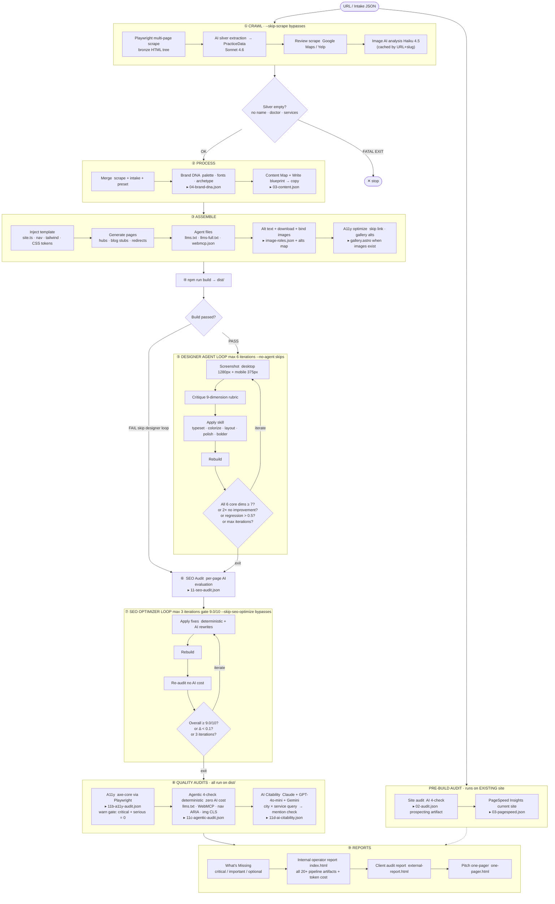

# Pipeline

> Single source of truth for the Groundwork Builder pipeline. Last updated to reflect phases through 4.67 (AI citability).
>
> **Other docs:** [`ARCHITECTURE.md`](./architecture/ARCHITECTURE.md) — codebase structure & tech decisions · [`CUSTOMER_JOURNEY.md`](./lifecycle/CUSTOMER_JOURNEY.md) — sales & lifecycle

---

## One-liner

Scrape an existing dental site → AI-extract structured data → merge with intake → define brand + creative direction → generate content → build Astro → iterate until quality gates pass → audit + report.

---

## Vocabulary

Several terms are easy to confuse — they all touch "design" or "practice" but mean different things:

| Term | What it is | Where it lives |
|---|---|---|
| **account** / **practice** (CRM sense) | A real dental practice we prospect, audit, or build for | `accounts` D1 table |
| **sourced practice** | A prospect pulled from Google Places (pre-CRM) | `sourced_practices` D1 table |
| **design library** | Compact ~1–2 KB design *fingerprints* (own / inspo / anti) the Creative Director samples to diverge-from / pull-toward | `_memory/library/*.json` + `index.json` |
| **design profile** | A denormalized **read-cache** of the design library, for the ops-dashboard's "Design Library" tab only — the builder never reads it | `accounts.design_profile` JSON column (D1) |
| **design catalog** | Curated, hand-tuned *template specs* (full design + audit gates) the builder applies via `--reference <id>` | `docs/design-catalog/runs/<slug>/entry.json` (+ `showcase.html`) |

Rule of thumb: **"practice" = a client**, **"library" = fingerprints that steer the AI director**, **"catalog" = concrete templates the builder can lock onto**.

---

## Critical architecture split: pre-build vs post-build audits

The pipeline runs **two separate audit tracks** against two different sites. This distinction matters for what we can show clients.

| | Pre-build audit | Post-build audit |
|---|---|---|
| **Runs on** | Client's EXISTING site | Our newly built `dist/` |
| **When** | Phase 2 (before any building) | Phases 6–8 (after build) |
| **Checks** | AI SEO 4-check, PageSpeed Insights | SEO optimizer, A11y, Agentic 4-check, AI citability |
| **Client artifact** | `external-report.html`, `one-pager.html` | Quality score in internal report |
| **Purpose** | Show what's broken → justify rebuild | Confirm output meets all gates |

**Pre-build agentic check:** `audit-agentic-existing.js` runs as Phase 4f in `audit-site.js` and Phase 2b3 in `build-site.js`. Fetches llms.txt, webmcp.json, and homepage HTML from the live site and scores all 4 agentic criteria. Result (`_data/agentic-existing.json` / artifact `02b-agentic-existing`) is surfaced in the audit report Scorecard tab as a before-state. Existing sites typically score 0/4; the rebuilt site scores 4/4, showing the delta to prospects.

---

## High-zoom flow



---

## Gates & thresholds

| Gate | Phase | Threshold | Behavior |
|------|-------|-----------|----------|
| Silver empty | 1b | no name + no doctor + no services | **Fatal exit** |
| No data at all | 2 | `!scraped && !intake` | **Fatal exit** |
| Build fail | 4 | `npm run build` error | Skip designer loop; continue to audits |
| Designer agent | 5 | All 6 core dims ≥ 7 | Exit loop; ship |
| Designer agent | 5 | 2× no improvement | Exit loop at local max |
| Designer agent | 5 | Score drop > 0.5 | Rollback skill, retry |
| SEO optimizer | 7 | Overall ≥ 9.0/10 | Exit loop; target reached |
| SEO optimizer | 7 | Δ < 0.1 | Exit loop; diminishing returns |
| SEO optimizer | 7 | 3 iterations | Exit loop; max reached |
| A11y | 8 | critical + serious > 0 | **Warning** (non-fatal); surfaced in report |

---

## Phase details

### Phase 1 · Crawl

**Sub-phases run concurrently after bronze scrape:**

| Sub-phase | Code phase | Tool | Skip flag | Cost |
|-----------|-----------|------|-----------|------|
| Bronze scrape | 1a | Playwright | `--skip-scrape` | Free |
| Silver extraction | 1b | Sonnet 4.6 | `--skip-scrape` | Moderate |
| Review scrape | 1c | HTTP | None | Free |
| Image AI analysis | 1d | Haiku 4.5 | `--skip-images` | Low (cached) |

**Silver extraction** is the highest-risk phase — a bad extraction cascades into every downstream step. The `isEmpty` check is a hard gate: if no `name`, `doctor`, or `services` come back, the pipeline stops.

**Image analysis** is cached by `URL+slug` in `_memory/images/<slug>.json` — repeated builds of the same site don't re-classify.

**`additionalContent[]`** — Silver sweeps for content that doesn't fit any strict bucket (pull-quotes, philosophy paragraphs, welcome intros, blog bodies). Capped at 30 items × 2,200 chars. Downstream consumers filter by `type` and `source` URL. The coverage audit flags `additional-content-not-surfaced` if rescued content doesn't appear in any built page.

---

### Phase 2 · Process

Runs on **existing site data** (bronze + silver + intake). This is the pre-build window.

| Step | Code phase | Tool | Skip flag |
|------|-----------|------|-----------|
| Merge scrape + intake + preset | 2 | Deterministic | — |
| Site audit AI 4-check | 2b | Sonnet 4.6 | `--skip-audit` |
| PageSpeed Insights current site | 2b2 | PSI API | `--skip-pagespeed` |
| Brand DNA | 2c/2d | Sonnet 4.6 | `--skip-design` |
| Content Map (blueprint) | 2e | Sonnet 4.6 | `--skip-content` |
| Content Write (copy) | 2f | Sonnet 4.6 | `--skip-content` |

The **site audit** and **PageSpeed** scores feed `external-report.html` (client-facing) and `one-pager.html` (pitch). These are the before-state artifacts clients see.

**Brand DNA** produces `{ color, typography, mood, archetype }`. If it returns null, the pipeline keeps the scraped brand.

**Content Map + Write** runs as two steps: Map audits existing content quality (keep/optimize/create decisions per section), Write generates copy against the plan. If either fails, the pipeline continues in legacy single-pass mode.

**Creative Director** (runs during 2e/2f assemble) samples `_memory/library/`:
- **own** — recent builds to diverge from
- **inspo** — mood-matched external references (Notion, Linear, Stripe, etc.)
- **anti** — explicit AI-slop patterns to avoid

Catalog source: `scripts/pipeline/config/design-library-catalog.json`. Import once (or after edits):

```bash
node scripts/pipeline/import-design-library-cli.js --validate   # schema check
node scripts/pipeline/import-design-library-cli.js              # write to _memory/library/
node scripts/pipeline/import-design-library-cli.js --dry-run    # preview only
```

After each ship, `distill-design.js` auto-adds the build as `tag: own` so future runs diverge from it.

---

### Phase 3 · Assemble

| Step | Code phase | What it writes |
|------|-----------|----------------|
| Inject template | 3a | `site.ts`, `nav.ts`, `tailwind.config.mjs`, `astro.config.mjs` |
| Write Design DNA + global CSS | 3a-bis | `src/config/design-dna.ts`, global CSS tokens |
| Generate pages | 3b | `src/pages/services/<slug>.astro`, services index, about, contact |
| Redirects | 3b-bis | `public/_redirects` (Cloudflare 301s from old URL structure) |
| Blog stubs | 3c | `src/content/blog/<slug>.md` |
| Agent files | 3c-bis | `public/llms.txt`, `public/llms-full.txt`, `public/.well-known/webmcp.json` |
| Ensure image alt text | 3c-ter | Fills missing `alt` on `images.items[]` before download (role-based fallbacks) |
| Download images | 3d | `public/images/` + `image-source.json` sidecar |
| Enrich sidecar alts | 3e-pre | Patches any remaining empty alts in `image-source.json` before roles write |
| Bind image roles | 3e | `public/images/image-roles.json` (+ `alts` map: localPath → description) |
| A11y optimize | 3f | Gallery page inject (`src/pages/gallery.astro`) when images exist; idempotent sidecar re-check |

---

### Phase 4 · Build

`npm run build` → `dist/`. Astro build errors are non-recoverable; the pipeline skips the designer agent loop but continues to SEO and quality audits so you still get a report.

---

### Phase 5 · Designer Agent Loop

Runs when build passes AND `ANTHROPIC_API_KEY` is set. Skippable with `--no-agent`.

**Per iteration:**
1. **Observe** — Playwright screenshot at desktop (1280×900) and mobile (375×812)
2. **Critique** — Score 9 dimensions with Sonnet: typography, color_contrast, spatial_layout, information_hierarchy, craft, ux_writing, trust_signals, distinctiveness, imagery
3. **Act** — Pick the lowest-scoring fixable dimension; run its skill
4. **Rebuild** — `npm run build`
5. **Gate check** — Exit if all 6 core dims ≥ 7, or 2× no improvement, or score regression, or max iterations

**Skill mapping:**

| Dimension | Skill |
|-----------|-------|
| typography | typeset |
| color_contrast | colorize |
| spatial_layout, information_hierarchy | layout |
| craft, ux_writing, trust_signals | polish |
| distinctiveness | bolder |
| imagery | imagery |

**Non-blocking dimensions:** imagery, distinctiveness, trust_signals — surfaced as action items in the report if < 7, but don't hold up the gate.

**Artifact:** `_pipeline/10-agent.json` — iterations, gate_pass, finalScore per dimension.

---

### Phase 6 · SEO Audit

Per-page AI evaluation against a scoring rubric (title, meta, H1, schema, content depth, internal links, image alt, CTA presence, FAQ). Produces an `overall` score /10 plus per-lens breakdown (traditional SEO vs AI discoverability). Feeds the SEO optimizer loop.

**Artifact:** `_pipeline/11-seo-audit.json`

---

### Phase 7 · SEO Optimizer Loop

Iterative fix cycle. Skippable with `--skip-seo-optimize`.

**Per iteration:** Apply fixes (deterministic first, then AI rewrites if deterministic didn't move the needle enough) → Rebuild → Re-audit (deterministic only, no AI cost) → check gate.

**Final audit:** If any fixes were applied, runs one full AI evaluation to capture the final state for the report.

**Exit reasons:** score target reached · no fixable issues remain · rebuild failed · diminishing returns (Δ < 0.1) · max 3 iterations.

---

### Phase 8 · Quality Audits

All three run against `dist/` after the SEO loop. All are non-fatal (failures go into the report, don't stop the pipeline).

**A11y (axe-core):** Playwright browser + axe-core. Critical + serious violations surface a ship-gate warning. `_pipeline/11b-a11y-audit.json`.

**Proactive a11y (before build):** Template ships skip link, `:focus-visible` rings, and `prefers-reduced-motion` in `src/styles/global.css`. Pipeline Phase 3c-ter/3f fills missing image alt text and injects a populated gallery page. Axe still runs post-build as the verification gate — it does not auto-fix violations.

**Agentic 4-check (deterministic, zero AI cost):**

| Check | How |
|-------|-----|
| llms.txt | `public/llms.txt` exists and non-empty |
| WebMCP tools | `public/.well-known/webmcp.json` exists with ≥ 1 tool |
| Accessibility for agents | Built `index.html` has `<nav aria-label>` + `aria-haspopup` on dropdowns |
| Layout stability (CLS proxy) | All `` in built `index.html` have `width` + `height` |

Every site we build passes 4/4 by construction (Header ARIA + BaseLayout WebMCP + generate-agent-files phase). `_pipeline/11c-agentic-audit.json`.

**AI Citability:** Prompts Claude Haiku (always), GPT-4o-mini (`OPENAI_API_KEY`), Gemini Flash (`GOOGLE_GEMINI_API_KEY`) with: *"I'm looking for a dentist in [city, state] for [top service] — which practices do you recommend?"* Checks for practice name mention. Cost: ~$0.001/run with Haiku alone. `_pipeline/11d-ai-citability.json`.

---

### Phase 9 · Reports

| Artifact | Audience | Contents |
|----------|----------|---------|
| `_pipeline/missing.html` | Operator | What's Missing — critical/important/optional items with severity |
| `_pipeline/index.html` | Operator | Full pipeline report — all 20+ artifacts, token cost ledger, design system, page inventory |
| `_pipeline/external-report.html` | Client | Before/after audit — PSI scores, SEO issues, schema gaps |
| `_pipeline/one-pager.html` | Client / Sales | Pitch summary — key before/after signals, why rebuild |

---

## Artifact index

| File | Phase | Contents |
|------|-------|---------|
| `_pipeline/01-bronze.json` | 1a | Raw pages[], HTML, headings, images |
| `_pipeline/01-scrape.json` | 1b | Extracted practice, doctor, services, content, confidence flags |
| `_pipeline/02-audit.json` | 2b | AI 4-check scores on existing site |
| `_pipeline/03-pagespeed.json` | 2b2 | Mobile + desktop PSI scores, Core Web Vitals |
| `_pipeline/03-content-blueprint.json` | 2e | Coverage: totalSections, byQuality, byAction |
| `_pipeline/03-content.json` | 2f | Generated homepage, about, FAQ copy |
| `_pipeline/04-brand-dna.json` | 2c/2d | Palette, typography, mood, archetype |
| `_pipeline/05-assemble.json` | 3a-bis | Design DNA, section order, image binding |
| `_pipeline/06-merge.json` | 2 | Practice summary, servicesOffered, redirect count |
| `_pipeline/07-image-analysis.json` | 1d | AI classification per image URL |
| `_pipeline/07-inject.json` | 3a | Files injected list |
| `_pipeline/08-pages.json` | 3b | Pages generated, blog stubs, images downloaded |
| `_pipeline/09-image-roles.json` | 3e | hero, doctorPortraits, gallery, servicePages roles, `alts` map |
| `_pipeline/09-build.json` | 4 | buildSuccess, placeholders, brokenLinks, buildIntegrity |
| `_pipeline/10-agent.json` | 5 | Designer agent iterations, gate_pass, dimension scores |
| `_pipeline/11-seo-audit.json` | 6+7 | per-page scores, overall/10, topIssues |
| `_pipeline/11b-a11y-audit.json` | 8 | violationCount, byImpact, topIssues |
| `_pipeline/11c-agentic-audit.json` | 8 | 4-check results: llms.txt, WebMCP, ARIA, CLS |
| `_pipeline/11d-ai-citability.json` | 8 | Per-LLM mention check, fraction |
| `_pipeline/12-seo-optimize.json` | 7 | iterations, applied fixes, startingOverall, finalOverall |
| `_pipeline/99-cost.json` | 9 | callCount, tokens in/out, total cost, per-phase breakdown |
| `public/llms.txt` | 3c-bis | Machine-readable site summary |
| `public/llms-full.txt` | 3c-bis | Expanded AI context: doctor bios, hours, service descriptions, FAQs |
| `public/.well-known/webmcp.json` | 3c-bis | Agent-callable action declarations |
| `public/_redirects` | 3b-bis | 301 redirects from old URL structure |
| `public/images/image-roles.json` | 3e | Role assignments + `alts` map for all downloaded images |
| `src/config/design-dna.ts` | 3a-bis | Design system tokens for runtime |
| `_memory/runs.jsonl` | 9 | Local run log: archetype, fonts, colors, build_success |

---

## Skip flags

| Flag | Skips | Notes |
|------|-------|-------|
| `--skip-scrape` | Phases 1a–1d | Re-uses cached bronze if available |
| `--skip-images` | Phase 1d image analysis | Vision classification only |
| `--skip-audit` | Phase 2b AI site audit | Not the post-build audits |
| `--skip-pagespeed` | Phase 2b2 PSI | |
| `--skip-design` | Phase 2c/2d brand DNA | Uses scraped brand |
| `--skip-content` | Phases 2e+2f | Legacy single-pass mode |
| `--skip-build` | Phase 4 Astro build | Pages still generated |
| `--skip-generate` | Phase 3b section generation | |
| `--skip-seo-optimize` | Phase 7 SEO optimizer loop | |
| `--no-agent` | Phase 5 designer agent | Build still runs |
| `--dry-run` | Everything after Phase 2 | Prints merged JSON and exits |

**Agent control:**
- `--agent` — force-enable the designer agent even if `GROUNDWORK_AGENT` env is not set
- `--agent-iterations N` — max iterations (default 6)
- `--fix-worklist <path>` — grader-emitted fix-worklist.json gates the SEO optimizer tiers

---

## Data layers

| Layer | Produced by | Shape | Persisted at |
|-------|------------|-------|-------------|
| Bronze | Phase 1a scraper | Raw `pages[]` with HTML, headings, paragraphs, JSON-LD, images | `_pipeline/01-bronze.json` |
| Silver | Phase 1b AI extraction | `{ practice, doctor, additionalDoctors, services, content, brand, signals }` | `_pipeline/01-scrape.json` |
| Merged | Phase 2 intake merger | Silver + intake JSON, normalized | `_pipeline/06-merge.json` |
| Brand DNA | Phase 2c/2d | `{ palette, typography, mood, archetype, voice }` | `_pipeline/04-brand-dna.json` |
| Design DNA | Phase 3a-bis director | `{ archetype, heroVariant, designTokens, sectionOrder }` | `src/config/design-dna.ts` |
| Image roles | Phase 3e binding bridge | `{ hero, doctorPortrait, doctorPortraits, team, gallery, byPage, alts }` | `public/images/image-roles.json` |
| Design library | Creative Director (`sampleLibrary`) | `{ own, inspo, anti }` fingerprints | `_memory/library/*.json` |
| Per-section content | Phase 3b section skills | One `*.content.json` per variant section | `src/components/generated/*.content.json` |
| Built HTML | Phase 4 Astro build | Static HTML + assets | `dist/` |
| Coverage audit | Phase 9 diff comparator | `{ findings, summary }` | `_pipeline/coverage-audit.{json,md}` |

---

## Variant library

The director picks one variant per section based on archetype. Variants are deterministic downstream of the director's choice.

| Dimension | Variants | Source |
|-----------|----------|--------|
| Hero | centered · split · split-offset · poster · text-only | `src/components/variants/hero/` |
| Services | card-grid · alternating-rows · accordion · two-col-feature · numbered-list | `src/components/variants/services/` |
| Doctor intro | split-photo · full-width-card · editorial-full · minimal-text · two-col-brief | `src/components/variants/doctor-intro/` |
| Reviews | card-row · pull-quotes · single-featured · list-testimonials · grid-mosaic | `src/components/variants/reviews/` |
| CTA | centered-banner · split-image · inline-minimal · floating-card · two-button | `src/components/variants/cta/` |
| FAQ | accordion-expandable · two-column · simple-stack · cards-grid · split-by-category | `src/components/variants/faq/` |
| Nav | left-logo · centered-logo · split-logo · transparent-overlay · top-bar | `src/components/Header.astro` |
| Footer | minimal-dark · editorial-split · classic-4col · compact-centered · bold-cta-footer | `src/components/Footer.astro` |
| Gallery | masonry-3col · editorial-2col · filmstrip · featured-grid · full-bleed-row | `src/components/generated/GallerySection.astro` |

8 dimensions × 5 variants = **40 distinct visual states**. Archetype-to-variant mapping is locked by `creative/derive-design-tokens` to guarantee visual divergence between archetypes.

---

## Skill maturity scale

| Level | Meaning |
|-------|---------|
| **stub** | Placeholder, barely works. Not safe to ship from. |
| **working** | Reliable but unpolished. Output is acceptable. |
| **polished** | Well-tuned. Edge cases handled. Multiple iterations. |
| **mature** | Battle-tested across many builds. Has eval fixtures. |

---

## Living notes

### Done

- [x] Wire content briefs to skill-loader
- [x] Migrate ai-design / ai-audit / ai-content to skill-loader
- [x] HTML dashboard view
- [x] Coverage audit: flag mismatched contact info (phone, address, hours)
- [x] Eval fixtures (5 archetypes: lbpds-pediatric, chang-orthodontics, orange-county-dental-care, oc-healthy-smiles, elements-dentistry — 220/220 shape checks)
- [x] Map prompt page-inventory cap (PAGE_INVENTORY_CAP = 30; prevents 376K-char prompts on CMS-scale sites)
- [x] ai-call retry policy (3 retries, exponential backoff 1.5s → 4s → 10s)
- [x] Design Extract: pull colors from bronze CSS (rankCssColors by frequency × saturation)
- [x] Per-skill output validators (WCAG calc on brand-direction, JSON-LD name validator on silver)
- [x] Map / Write split (Content Map = blueprint, Content Write = copy)
- [x] Density ownership locked to Brand Direction only
- [x] Silver per-page parallel extraction (filter → parallel per page → merge)
- [x] Tone enum for audit.tone.recommended (warm | clinical | editorial | bold | refined)
- [x] Per-archetype tone calibration in content-write
- [x] Per-vertical section-order priors in director
- [x] Supabase → local _memory/ + Cloudflare D1 CRM (`d1.js`; Airtable retired June 2026)
- [x] Silver per-page extraction cache (sha256 fingerprint + prompt version + model)
- [x] Auto-fuzzy-match service deduplication (Jaccard ≥ 0.7 + DISTINCT_MODIFIERS allowlist)
- [x] Lighthouse Agentic Browsing (4/4 deterministic checks) — Phase 4.66 + Header ARIA + BaseLayout WebMCP + generate-agent-files
- [x] llms-full.txt (expanded AI context: doctor bios, hours, full service descriptions, FAQs)
- [x] AggregateRating schema — injected when googleRating + reviewCount are present
- [x] AI Citability audit — Phase 4.67, Claude + optional GPT + optional Gemini
- [x] Design library catalog — 16 inspo + 5 anti fingerprints (`scripts/pipeline/config/design-library-catalog.json`); mood-aware sampling in Creative Director
- [x] Proactive a11y — skip link, reduced motion, alt enrichment (3c-ter/3e-pre), gallery inject (3f), components read `alts` via `imageAlt()`, axe post-build gate unchanged
- [x] Image roles skill docs — extraction/image-roles now documents deterministic binding (not Vision); skill catalog regenerated

- [x] Catalog `--reference auto` + `GROUNDWORK_DEFAULT_REFERENCE` (curated light runs)

- [x] Phase 3 harden — untrack `clients/`, quarantine Airtable + dead modules under `scripts/legacy/` + `lib/_legacy/`, client dupe archive (`npm run prune:clients`), STEP-7↔Phases 5–8 mapping

### Pending

- [x] Pre-build agentic check on EXISTING site — Phase 4f (audit-site.js) + Phase 2b3 (build-site.js) → `_data/agentic-existing.json` → Scorecard tab before-state
- [ ] More fixture archetypes — single-doctor general practice, sparse-content (60%+ `missing`), non-warm tone (clinical/editorial/bold/refined)
- [ ] DataForSEO warm-lead module — SERP local-pack position, GBP completeness, review velocity, NAP consistency; trigger via manual D1 account flag
- [x] Cloudflare Worker self-serve "Grade My Site" — homepage HTML checks + PSI + Growth Score JSON (`npm run grade` / `workers/grade-my-site/`; citability still optional follow-up)
