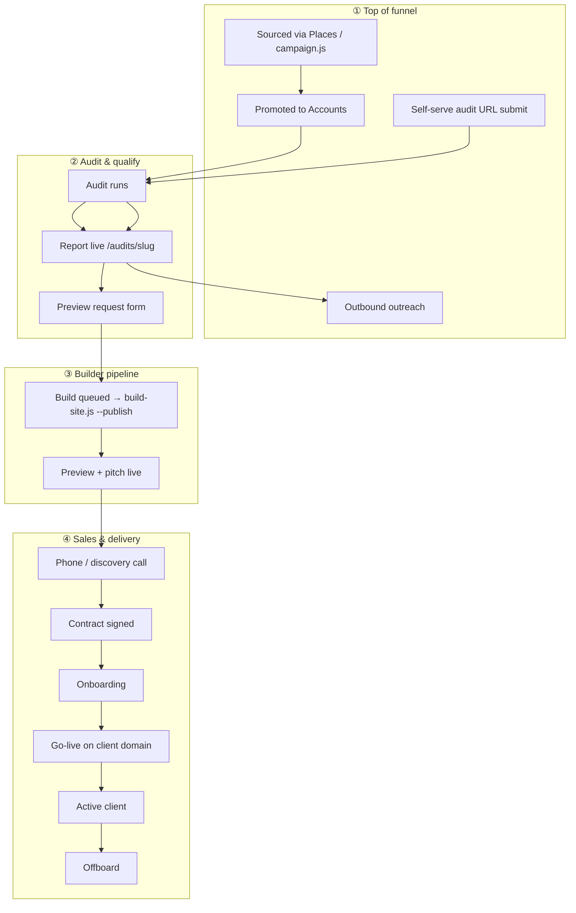

# Customer journey — Groundwork Dental

Single map of how a dental practice moves from prospect to active client. Use this doc to decide where to add automation, runbooks, and Airtable stages — not as a duplicate of the technical pipeline or GBP setup guides.

**Related (deep dives — read there, not here):**

| Topic | Doc |
|-------|-----|
| Builder pipeline (scrape → pitch) | [ARCHITECTURE.html](../architecture/ARCHITECTURE.html) |
| Audit outputs + preview-request API | [audit-architecture.md](../../scripts/pipeline/config/audit-architecture.md) |
| Sourcing methodology + scoring model | [METHODOLOGY.md](../sourcing/METHODOLOGY.md) |
| Sourcing production ops (metros, campaign) | [RUNBOOK.md](../sourcing/RUNBOOK.md) |
| Grader / public audit tool plan | [GRADER_PLAN.md](../GRADER_PLAN.md) |
| GBP API setup (post-sign onboarding) | [gbp-setup-walkthrough.md](../gbp/gbp-setup-walkthrough.md) |
| Public marketing artifacts | [resources/README.md](../resources/README.md) |

---

## Terminology

| Term | Meaning here |
|------|----------------|
| **Customer journey / client lifecycle** | End-to-end path: first touch → signed → live → churn |
| **Lifecycle stage** | Single CRM status on an **Account** row (Airtable `Lifecycle Stage`) |
| **Funnel top** | Sourced practices not yet in CRM (`Sourced Practices` table) |
| **Warm lead** | Prospect who requested a preview from an audit one-pager |
| **Runbook** | Step-by-step ops doc for one milestone (e.g. `docs/gbp/`) |

---

## Journey at a glance

Two entry paths merge before the builder pipeline:



Phases ③ are documented in [ARCHITECTURE.html](../architecture/ARCHITECTURE.html). Phases ①–② and ④ are this doc.

---

## Milestones

| # | Milestone | Account lifecycle stage | Airtable tables | Trigger | Automated? | Doc / code |
|---|-----------|-------------------------|-----------------|---------|------------|------------|
| 1 | Practice sourced | — | `Sourced Practices` | `npm run sourcing:run` / `sourcing:campaign` | ✅ | [RUNBOOK.md](../sourcing/RUNBOOK.md) |
| 2 | Promoted to CRM | *(none yet)* | Accounts + Sourced | `npm run sourcing:promote -- <place_id>` | ⚡ Script; outreach manual | [promote.js](../../scripts/sourcing/promote.js) |
| 3 | Audit started | **Prospect** | Accounts + Audits | `audit-site.js` → `startAudit()` | ✅ | [airtable.js](../../scripts/pipeline/lib/airtable.js) |
| 4 | Audit complete | **Audited** | Accounts + Audits | Audit finishes; `hostAuditReport()` | ✅ | [audit-architecture.md](../../scripts/pipeline/config/audit-architecture.md) |
| 5 | Warm lead (preview request) | **Preview Requested** | Accounts + Audits + Builds | Form on `audit-summary.html` | ✅ CRM + optional CI build | [audit-preview-request.js](../../scripts/pipeline/lib/audit-preview-request.js) |
| 6 | Build running | — | Builds (`Queued` row) | `audit-preview-build.yml` or manual `build-site.js --publish` | ✅ if secrets set | [ARCHITECTURE.html](../architecture/ARCHITECTURE.html) |
| 7 | Pitch delivered | **Pitched** | Accounts + Builds (new row) | `publish.js` → `recordBuildRun()` | ✅ | [publish.js](../../scripts/pipeline/lib/publish.js) |
| 8 | Handoff baseline captured | *(at Pitched)* | Accounts | `publish.js` when ship gates pass | ✅ | [HANDOFF.md](../onboarding/HANDOFF.md) |
| 9 | Discovery / sales call | **Contacted** | Accounts | Manual (`setAccountLifecycle`) | ⚡ | `airtable.js` |
| 10 | Client signed | **Signed** | Accounts | Contract / payment | ⚡ Manual | `setAccountLifecycle()` |
| 11 | Onboarding | **Onboarding** | Accounts | Post-sign checklist | ⚡ GBP + intake | [ONBOARDING.md](../onboarding/ONBOARDING.md) |
| 12 | Live on client domain | **Live** | Accounts + Builds | DNS cutover | ⚡ Manual | [ONBOARDING.md §7](../onboarding/ONBOARDING.md#phase-7--dns-cutover-and-go-live) |
| 13 | Active / support | **Active** | Accounts | Ongoing | ⚡ Manual | — |
| 14 | Churn / offboard | **Churned** | Accounts | Engagement ends | ⚡ GBP offboarding | [gbp-offboarding.md](../gbp/gbp-offboarding.md) |

**Bold** = supported in `airtable.js` (`ACCOUNT_LIFECYCLE_STAGES`). Stages through **Pitched** are set automatically; **Contacted → Churned** via `setAccountLifecycle(slug, stage)` or manual Airtable edit.

### Hosted URLs (after audit / publish)

| Artifact | URL |
|----------|-----|
| Audit one-pager | `https://groundworkdental.com/audits/<slug>/` |
| Full audit report | `https://groundworkdental.com/audits/<slug>/audit-report` |
| Before/after diff | `https://groundworkdental.com/audits/<slug>/before-after` |
| Preview site | `https://<slug>.groundworkdental.com` |
| Pitch page | `https://groundworkdental.com/pitch/<slug>/` |

### Source attribution

Two different fields — don't conflate them:

| Context | Field | Values in code |
|---------|-------|----------------|
| **Accounts** | `Source` | `self-serve`, `manual`, `biz-dev`, `sourcing` (from promote), audit `--source` |
| **Audits** | `Submission Method` | Mapped from audit `--source`: `self-serve` → Customer Submission, `manual` / `biz-dev` → Manual Entry, `system` → System Trigger |

Audit CLI: `node scripts/pipeline/audit-site.js --url … --source self-serve|manual|biz-dev` (default `manual`).

Promote sets Accounts `Source: sourcing` and does **not** set `Lifecycle Stage` — that happens at first audit (`Prospect`).

---

## Airtable model

Four tables across funnel + pipeline (see [pipeline airtable.js](../../scripts/pipeline/lib/airtable.js) and [sourcing airtable.js](../../scripts/sourcing/lib/airtable.js)):

```
Sourced Practices  ──promote──►  Accounts  ──1:N──►  Audits
     │  Status:                        │                  │
     │  contacted / replied             └──1:N──►  Builds
     │  promoted-to-accounts
     └── Quality Score, Missing Items (outreach pitch)
```

| Table | One row per… | Key fields (current schema) |
|-------|--------------|----------------------------|
| **Sourced Practices** | Places scrape | `Quality Score`, `Weakness Score`, `Missing Items`, `Tier`, `Quadrant`, `MSA / Market`, `Status` |
| **Accounts** | Practice (identity + lifecycle) | Slug, contact, `Lifecycle Stage`, `Source`, `Baseline PageSpeed`, `Baseline Ranks`, `Launch Date`, `Re-audit Due`, `Intake JSON` |
| **Audits** | Audit run | `Status`: Auditing → Audited / Preview Requested / Failed; scores, report URL |
| **Builds** | Generated site attempt | `Status`: Queued (preview form) or Pitched (publish); preview/pitch URLs, rescan diff |

**Account lifecycle (auto in code):** Prospect → Audited → Preview Requested → Pitched (+ baseline fields at handoff)

**Account lifecycle (manual / `setAccountLifecycle`):** Contacted → Signed → Onboarding → Live → Active → Churned

Full list: `ACCOUNT_LIFECYCLE_STAGES` in `scripts/pipeline/lib/airtable.js`.

**Sourced outreach (manual today):** `Status` on Sourced Practices includes `contacted`, `replied`, `promoted-to-accounts` — tracks outreach before an Account exists.

---

## Automation map

| Event | What happens today | Next automation candidate |
|-------|-------------------|---------------------------|
| Metro sourcing completes | Rows in `Sourced Practices`; checkpoints in `_sourcing/` | Airtable view alert for new Prime quadrant |
| Audit completes | Account `Audited`; summary at `/audits/<slug>/` | Email with audit link |
| Preview form submit | Account `Preview Requested`; Audit updated; Build `Queued`; optional workflow | Slack/Asana task for follow-up call |
| CI build + publish | New Build row `Pitched`; Account `Pitched`; preview + pitch URLs | Email pitch link to contact |
| Publish timeout / partial run | `rescue-build.js` backfills scores + before-after | Auto-retry workflow |
| Phone call logged | Sourced `Status: contacted` (manual) or nothing on Account | Flip Account to `Contacted` |
| Contract signed | Nothing in CRM | Flip to `Signed`; send onboarding checklist |
| GBP setup call done | Manual; tokens in `.env` | Sub-checklist tied to client slug |
| DNS live | Manual | Flip to `Live`; GSC verification reminder |
| Engagement ends | [gbp-offboarding.md](../gbp/gbp-offboarding.md) | Flip to `Churned` |

### Warm-lead path (implemented)

```
audit-summary.html CTA
  → POST /api/audit-preview-request
     (local: Studio POST or request-preview.js CLI)
  → upsert Account (Preview Requested)
  → update Audit (Preview Requested)
  → create Build (Queued)
  → optional: audit-preview-build.yml (if GITHUB_TOKEN; skip if AUDIT_PREVIEW_AUTORUN=false)
  → build-site.js --url … --output clients/<slug> --publish
  → new Build row (Pitched) + Account Pitched
```

### Known gaps (remaining)

1. **Promote → no lifecycle stage** — Account exists with `Source: sourcing` but no stage until an audit runs.
2. **Audit-on-promotion** — Methodology describes deep audit when promoting; not auto-wired from `promote.js` yet ([METHODOLOGY.md §6](../sourcing/METHODOLOGY.md)).
3. **Re-audit automation** — `Re-audit Due` is set at handoff; calendar/Airtable automation not wired yet.
4. **Keyword rank module** — Baseline ranks are manual until GRADER ships ([GRADER_PLAN.md](../GRADER_PLAN.md)).

### Recently resolved

- ~~Duplicate Build rows~~ — `publish.js` updates `Queued` → `Pitched`/`Blocked` via `findQueuedBuildBySlug`.
- ~~Post-pitch lifecycle stages~~ — `ACCOUNT_LIFECYCLE_STAGES` + `setAccountLifecycle()` in `airtable.js`.
- ~~Supabase dependency~~ — Pipeline caches use `_memory/` local files; CRM is Airtable only. Historical data exported via `npm run migrate:supabase` (52 runs, 8 fingerprints, 130 image analyses).
- ~~Pre-call audit~~ — `npm run audit:precall` → `precall-brief.html` + vendor/TCO on sales one-pager.

---

## Doc layout (where things live)

Organize **by lifecycle phase**, not by tool. One hub (this file); deep dives stay in place.

```
docs/
├── lifecycle/
│   └── CUSTOMER_JOURNEY.md     ← you are here (index)
├── architecture/
│   ├── ARCHITECTURE.html       ← builder pipeline (phase ③)
│   └── CODEBASE_SUMMARY.md
├── sourcing/
│   ├── METHODOLOGY.md          ← scoring model, schema (phase ①)
│   └── RUNBOOK.md              ← how to run metros / campaign
├── gbp/                        ← post-sign runbooks (phase ④)
├── onboarding/
│   └── HANDOFF.md              ← baseline capture at preview-live (phase ④)
├── resources/                  ← public lead magnets
├── design/                     ← brand + generated-site rules
├── engineering/                ← IA/SEO/build conventions
├── GRADER_PLAN.md              ← public grader / lead-gen roadmap
└── STEP-7-AUDIT-REFINE.md      ← spec (future pipeline step; not built)
```

**Rule:** New operational steps get a runbook folder under the milestone they serve (`docs/gbp/` pattern). Update this hub’s milestone table with a link — don’t copy runbook content here.

### Useful npm scripts

| Command | Journey phase |
|---------|---------------|
| `npm run sourcing:metros` | List metro keys |
| `npm run sourcing:run -- --metro …` | Source one metro |
| `npm run sourcing:campaign` | All metros (resumable) |
| `npm run sourcing:promote -- <place_id>` | Promote to Accounts |
| `npm run audit -- --url …` | Run audit |
| `npm run audit:precall -- --url …` | Pre-call brief + full audit |
| `node scripts/pipeline/request-preview.js --slug …` | Simulate preview form |
| `node scripts/pipeline/rescue-build.js --slug … --build-id …` | Backfill failed publish |

---

## Open decisions (for review)

1. **Promote → audit** — Auto-run `audit-site.js` when promoting Tier A, or wait for outreach reply?
2. **Phone call trigger** — Manual `setAccountLifecycle('contacted')`, or webhook from Calendly / Asana?
3. **Signed → onboarding** — Single checklist in `docs/onboarding/` or per-topic runbooks (GBP, DNS, intake, GSC)?
4. **Notifications** — Email to prospect (audit, pitch, kickoff) vs Slack for internal ops?

---

*Last updated: 2026-06-03 — audited against repo (sourcing schema, promote.js, build/Airtable flow)*
