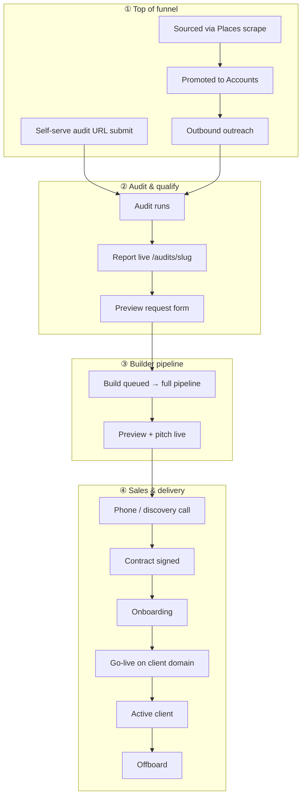

# Customer journey — Groundwork Dental

Single map of how a dental practice moves from prospect to active client. Use this doc to decide where to add automation, runbooks, and Airtable stages — not as a duplicate of the technical pipeline or GBP setup guides.

**Related (deep dives — read there, not here):**

| Topic | Doc |
|-------|-----|
| Builder pipeline (scrape → pitch) | [ARCHITECTURE.html](../architecture/ARCHITECTURE.html) |
| Audit outputs + preview-request API | [audit-architecture.md](../../scripts/pipeline/config/audit-architecture.md) |
| Sourcing funnel (Places scrape → Tier A) | [METHODOLOGY.md](../sourcing/METHODOLOGY.md) |
| GBP API setup (post-sign onboarding) | [gbp-setup-walkthrough.md](../gbp/gbp-setup-walkthrough.md) |
| Public marketing artifacts | [resources/README.md](../resources/README.md) |

---

## Terminology

| Term | Meaning here |
|------|----------------|
| **Customer journey / client lifecycle** | End-to-end path: first touch → signed → live → churn |
| **Lifecycle stage** | Single CRM status on an **Account** row (Airtable) |
| **Funnel top** | Sourced practices not yet in CRM (`Sourced Practices` table) |
| **Warm lead** | Prospect who requested a preview from an audit one-pager |
| **Runbook** | Step-by-step ops doc for one milestone (e.g. `docs/gbp/`) |

---

## Journey at a glance

Two entry paths merge before the builder pipeline:



Phases ③ are documented in [ARCHITECTURE.html](../architecture/ARCHITECTURE.html). Phases ①–② and ④ are this doc.

---

## Milestones

| # | Milestone | Account lifecycle stage | Airtable tables | Trigger | Automated? | Doc / code |
|---|-----------|-------------------------|-----------------|---------|------------|------------|
| 1 | Practice sourced | — | `Sourced Practices` | `scripts/sourcing/run.js` | ✅ | [METHODOLOGY.md](../sourcing/METHODOLOGY.md) |
| 2 | Promoted to CRM | Prospect | Accounts | `scripts/sourcing/promote.js` | ⚡ Script; outreach manual | same |
| 3 | Audit started | Prospect | Accounts + Audits | `audit-site.js` → `startAudit()` | ✅ | [airtable.js](../../scripts/pipeline/lib/airtable.js) |
| 4 | Audit complete | **Audited** | Accounts + Audits | Audit finishes; report hosted | ✅ | [audit-architecture.md](../../scripts/pipeline/config/audit-architecture.md) |
| 5 | Warm lead (preview request) | **Preview Requested** | Accounts + Audits + Builds | Form on audit one-pager | ✅ CRM + optional CI build | [audit-preview-request.js](../../scripts/pipeline/lib/audit-preview-request.js) |
| 6 | Build running | — | Builds (`Queued` → …) | GitHub dispatch or manual build | ✅ if `GITHUB_TOKEN` set | [ARCHITECTURE.html](../architecture/ARCHITECTURE.html) |
| 7 | Pitch delivered | **Pitched** | Accounts + Builds | Publish completes | ✅ | [publish.js](../../scripts/pipeline/lib/publish.js) |
| 8 | Discovery / sales call | *Contacted* (planned) | Accounts | Manual | ❌ | — |
| 9 | Client signed | *Signed* (planned) | Accounts | Contract / payment | ❌ | — |
| 10 | Onboarding | *Onboarding* (planned) | Accounts | Post-sign checklist | ⚡ GBP runbooks only | [docs/gbp/](../gbp/) |
| 11 | Live on client domain | *Live* (planned) | Accounts + Builds | DNS cutover | ❌ | [BUILD_BEST_PRACTICES.md](../engineering/BUILD_BEST_PRACTICES.md) |
| 12 | Active / support | *Active* (planned) | Accounts | Ongoing | ❌ | — |
| 13 | Churn / offboard | *Churned* (planned) | Accounts | Engagement ends | ⚡ GBP offboarding doc | [gbp-offboarding.md](../gbp/gbp-offboarding.md) |

**Bold** = implemented in code today. *Italic* = planned Airtable stage (not wired yet).

### Source attribution (Accounts)

| Pipeline `source` | Airtable `Submission Method` | Typical path |
|-------------------|-------------------------------|--------------|
| `self-serve` | Customer Submission | Website audit / preview form |
| `manual` | Manual Entry | You run audit or build by hand |
| `biz-dev` | Manual Entry | Outbound from sourced list |
| `system` | System Trigger | Internal automation |

---

## Airtable model

Three tables for the builder/grader path (see [airtable.js](../../scripts/pipeline/lib/airtable.js)):

```
Sourced Practices  ──promote──►  Accounts  ──1:N──►  Audits
                                    │
                                    └──1:N──►  Builds
```

| Table | One row per… | Key fields |
|-------|--------------|------------|
| **Sourced Practices** | Places scrape | Scores, tier, quadrant, outreach status |
| **Accounts** | Practice (identity + lifecycle) | Slug, contact, `Lifecycle Stage`, `Source` |
| **Audits** | Audit run | Scores, findings summary, report URL |
| **Builds** | Generated site | Preview URL, pitch URL, rescan diff, contact from preview form |

**Lifecycle progression (implemented):** Prospect → Audited → Preview Requested → Pitched

**Lifecycle progression (planned):** … → Contacted → Signed → Onboarding → Live → Active → Churned

---

## Automation map

What fires today vs good next hooks:

| Event | What happens today | Next automation candidate |
|-------|-------------------|---------------------------|
| Audit completes | Airtable `Audited`; report at `/audits/<slug>/` | Email with audit link |
| Preview form submit | `Preview Requested`; Build `Queued`; optional `audit-preview-build.yml` | Slack/Asana task for follow-up call |
| Build + publish complete | `Pitched`; preview + pitch URLs in Builds | Email pitch link |
| Phone call logged | Nothing in CRM | Flip to `Contacted`; log in Notes |
| Contract signed | Nothing in CRM | Flip to `Signed`; send onboarding checklist |
| GBP setup call done | Manual; tokens in `.env` | Flip sub-checklist item; link to client slug |
| DNS live | Manual | Flip to `Live`; GSC verification reminder |
| Engagement ends | [gbp-offboarding.md](../gbp/gbp-offboarding.md) | Flip to `Churned` |

Warm-lead path (implemented):

```
audit-summary.html CTA
  → POST /api/audit-preview-request
  → upsert Account (Preview Requested)
  → create Build (Queued)
  → optional GitHub workflow dispatch
  → full pipeline → Pitched
```

---

## Doc layout (where things live)

Organize **by lifecycle phase**, not by tool. One hub (this file); deep dives stay in place.

```
docs/
├── lifecycle/
│   └── CUSTOMER_JOURNEY.md     ← you are here (index)
├── architecture/
│   └── ARCHITECTURE.html       ← builder pipeline only (phase ③)
├── sourcing/
│   └── METHODOLOGY.md          ← funnel top (phase ①)
├── gbp/                        ← post-sign runbooks (phase ④, onboarding)
│   ├── gbp-setup-walkthrough.md
│   ├── gbp-client-browser-checklist.md
│   ├── gbp-cli.md
│   └── gbp-offboarding.md
├── onboarding/                 ← create when a 2nd runbook exists (DNS, intake, GSC)
├── resources/                  ← public lead magnets
├── design/                     ← brand + generated-site rules
└── engineering/                ← IA/SEO/build conventions
```

**Rule:** New operational steps get a runbook folder under the milestone they serve (`docs/gbp/` pattern). Update this hub’s milestone table with a link — don’t copy runbook content here.

---

## Open decisions (for review)

1. **Airtable stages** — Add Contacted → Signed → Onboarding → Live → Active → Churned to the Accounts `Lifecycle Stage` field?
2. **Phone call trigger** — Manual stage flip, or webhook from Calendly / dialer / Asana?
3. **Signed → onboarding** — Single checklist doc in `docs/onboarding/` or per-topic runbooks (GBP, DNS, intake, GSC)?
4. **Sourcing → audit** — Auto-run audit when promoting Tier A, or stay manual until outreach reply?
5. **Notifications** — Email first (audit link, pitch link, kickoff), or Slack for internal ops?

---

*Last updated: 2025-06-03 — v0.1 draft for review*
